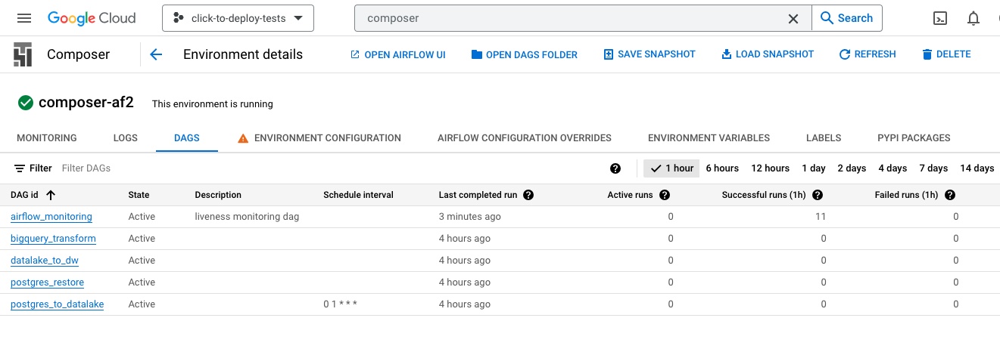
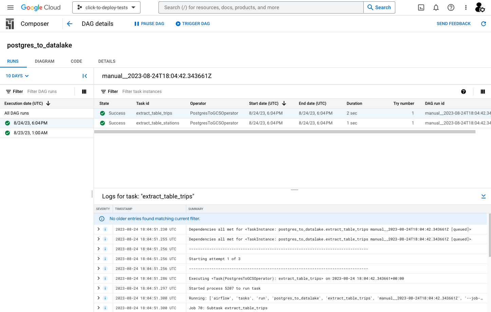
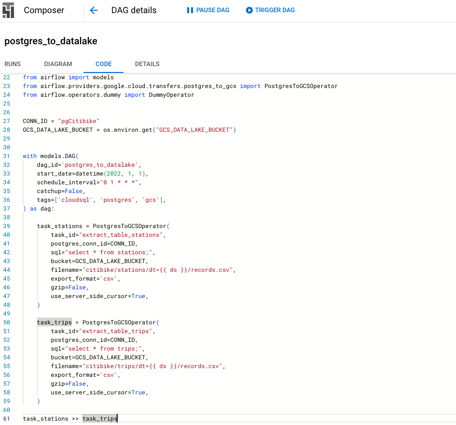
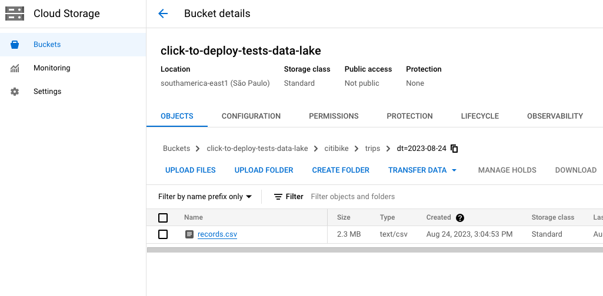

[](https://cloud.google.com/?utm_source=github&utm_medium=referral&utm_campaign=GCP&utm_content=packages_repository_banner)


# Easily Orchestrate and Manage Data Pipelines in Google Cloud 

## Introduction

This architecture uses click-to-deploy so you can spin up infrastructure in minutes using terraform!

The data analytics world relies on ETL and ELT pipelines to derive meaningful insights from data. Data engineers and ETL developers are often required to build dozens of interdependent pipelines as part of their data platform, but orchestrating, managing, and monitoring all these pipelines can be quite a challenge.

Cloud Composer is the answer to this challenge. To guarantee reliability and fault tolerance, Cloud Composer automatically handles task scheduling, monitoring, and retries. It provides built-in support for managing dependencies between tasks, allowing us to easily orchestrate the entire ETL workflow. Additionally, Cloud Composer offers monitoring and alerting capabilities, allowing us to track the progress of our pipeline and take the necessary actions if any problems arise.

In conclusion, our cloud ETL pipeline powered by Cloud Composer is a powerful and scalable solution for extracting, transforming, and loading data. It offers a wide range of features, including data source integration, transformation capabilities, fault tolerance, scalability, and seamless integration with other cloud services.

The following click-to-deploy architecture demonstrates how to use Cloud Composer to:

- [Restore a Postgres backup](./dags/postgres_restore.py)
- [Extract data from Postgres and load to Cloud Storage (Data Lake)](./dags/postgres_to_datalake.py)
- [Load data from Cloud Storage (Data Lake) to BigQuery (Data Warehouse)](./dags/datalake_to_dw.py)
- [Transform data on BigQuery](./dags/bigquery_transform.py)

## Use cases

These are some examples of the use cases you can build on top of this architecture:

* __Extracting data from a variety of sources__: Cloud Composer can be used to extract data from a variety of sources, including CSV files, JSON files, databases, and web APIs.

* __Transforming data__: Cloud Composer can be used to transform data in a variety of ways, including cleaning, filtering, and aggregating data.

* __Data integration from multiple sources__: Businesses often have data stored in various places, such as databases, third-party APIs, or log files. A data pipeline using Cloud Composer and BigQuery can integrate data from these different sources, harmonize it, and transform it into a unified format that is suitable for analysis. This ensures a consistent and reliable data source for decision-making.

* __Data warehousing and reporting__: Businesses often require a central data repository for storing and querying data. BigQuery, a fully managed data warehouse, provides fast and scalable storage and powerful querying capabilities. Businesses can automate the process of loading data into BigQuery by combining Cloud Composer's workflow orchestration capabilities, ensuring timely and accurate data updates for reporting and analysis purposes.
 
* __Data Quality and Governance__: A data pipeline can also be used to ensure data quality and compliance rules are met before loading data into BigQuery. Cloud Composer allows businesses to implement validation checks, data quality controls, and data cleansing processes as part of the data pipeline workflow. This guarantees that only high-quality and reliable data is loaded into BigQuery, enhancing the accuracy and integrity of analytical insights.

## Architecture

<p align="center"></p>

The main components that we would be setting up are (to learn more about these products, click on the hyperlinks)

* [VPC](https://cloud.google.com/vpc) : Global virtual network that spans all regions. Single VPC for an entire organization, isolated within projects. Increase IP space with no downtime.
* [Cloud Composer v2](https://cloud.google.com/composer) : A fully managed workflow orchestration service built on Apache Airflow.
* [Cloud SQL for Postgres](https://cloud.google.com/sql) :  Fully managed relational database service for MySQL, PostgreSQL, and SQL Server with rich extension collections, configuration flags, and developer ecosystems.
* [Cloud Storage (GCS) bucket](https://cloud.google.com/storage/) : Cloud Storage is a managed service for storing unstructured data. Store any amount of data and retrieve it as often as you like.
* [BigQuery datasets and tables ](https://cloud.google.com/bigquery): BigQuery is a serverless and cost-effective enterprise data warehouse that works across clouds and scales with your data. Use built-in ML/AI and BI for insights at scale. 

Check more operators available in [Airflow Google Operators doc](https://airflow.apache.org/docs/apache-airflow-providers-google/stable/operators/index.html).

## Costs

Pricing Estimates - We have created a sample estimate based on some usage we see from new startups looking to scale. This estimate would give you an idea of how much this deployment would essentially cost per month at this scale and you extend it to the scale you further prefer. Here's the [link](https://cloud.google.com/products/calculator/#id=f7caffab-fca3-490e-8654-f406df790929).

## Deploying the architecture

:clock1: Estimated deployment time: 26 min 48 sec

1. Click on Open in Google Cloud Shell button below.
<a href="https://ssh.cloud.google.com/cloudshell/editor?cloudshell_git_repo=https://github.com/GoogleCloudPlatform/click-to-deploy-solutions&cloudshell_workspace=cloud-composer-etl&cloudshell_open_in_editor=terraform/terraform.tfvars" target="_new">
    
</a>

2. Run the prerequisites script to enable APIs and set Cloud Build permissions.
```
sh prereq.sh
```

3. Run the Cloud Build Job
```
gcloud builds submit . --config build/cloudbuild.yaml
```

Once it is finished, go ahead to the Testing section.

## Testing the architecture 

After you deployed the solution, you can check the resources created and see how they work together.

First, go to  [Cloud Composer](https://console.cloud.google.com/composer/environments) and click on the `composer-af2` instance. Then, click on `DAGS`.



You can see all the DAGs running in that instance and the execution history. For example, click on the `postgres_to_datalake`.

In the run view, click on the most recent run. You will see each task executed by this DAG and individual logs per task at the bottom. 



In the image above, you can see the execution that happened on `8/24/23, 6:04PM` and its tasks status. For example, the task `extract_table_trips` used a `PostgresToGCSOperator`, which takes data from a Postgres directly to Google Cloud Storage, and it completed successfully in two seconds. If you want to inspect its code, you can click on Code tab.



In the image above, you can see that the `extract_table_trips` task queries the `trips` table in Postgres, then store the results into Google Cloud Storage using the path `citibike/trips/dt={{ ds }}/records.csv`. Airflow has [macros](https://airflow.apache.org/docs/apache-airflow/stable/templates-ref.html) like `{{ ds }}` that replaces it with the execution date, so you can separate the data you extracted each execution.

Finally, you can see the data store into GCS by going to the Data Lake bucket and accessing the path mentioned above.



Next step: do this same analysis with other dags.


## Cleaning up your environment

1. Click on Open in Google Cloud Shell button below.
<a href="https://ssh.cloud.google.com/cloudshell/editor?cloudshell_git_repo=https://github.com/GoogleCloudPlatform/click-to-deploy-solutions&cloudshell_workspace=cloud-composer-etl&cloudshell_open_in_editor=terraform/terraform.tfvars" target="_new">
    
</a>

2. Run the command below on Cloud Shell to delete the resources.
```
gcloud builds submit . --config build/cloudbuild_destroy.yaml
```
