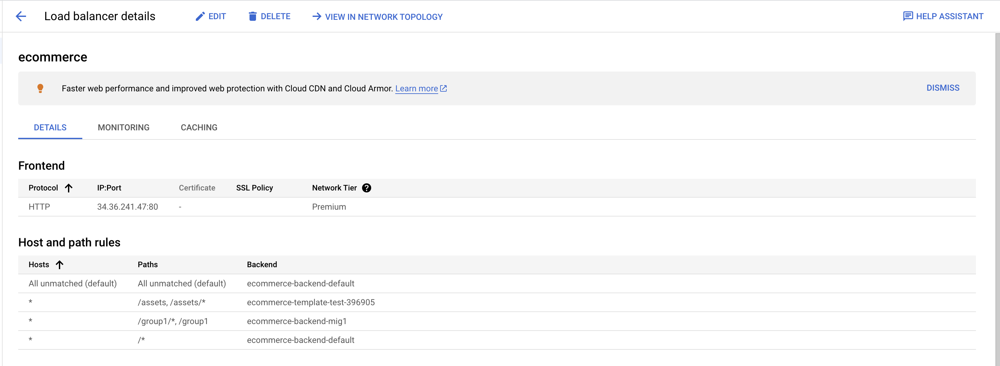

[](https://cloud.google.com/?utm_source=github&utm_medium=referral&utm_campaign=GCP&utm_content=packages_repository_banner)

# Host your Website on Google Cloud

## Introduction

This architecture uses click-to-deploy so you can spin up a configuration example of an [Ecommerce Web Hosting template](https://github.com/codewithsadee/anon-ecommerce-website).

This architecture creates a scalable, reliable, and consistent hosting environment. It enables automatic scaling of compute resources, efficient content delivery, robust storage and serving of static assets, and a managed database service for data persistence.

At the core of this architecture is Compute Engine, which provides virtual machines (VMs) to run your website or application. Compute Engine offers scalable and customizable VM instances that can be tailored to meet your specific workload requirements. To optimize content delivery and improve response times, Cloud CDN is integrated into the architecture. Cloud CDN caches static and dynamic content across a global network of edge locations, reducing latency and increasing performance for end-users.

Cloud Storage is used to store and serve static assets, such as images, videos, CSS, and JavaScript files. It provides a highly available and durable storage solution with automatic scalability. And for database needs, Cloud SQL provides a managed relational database service that ensures data consistency, scalability, and reliability. Cloud SQL offers fully managed MySQL and PostgreSQL databases, eliminating the need for manual database administration tasks. 

In summary, this architecture ensures that your website or application can handle high traffic loads, delivers content quickly to users worldwide, and maintains data integrity and availability.

## Use cases

* __Any kind of Website that requires__ :

    * __Cost Optimization__ : The architecture allows for cost optimization by leveraging Cloud Storage and Compute Engine. Cloud Storage provides a cost-effective solution for storing static content, such as images and CSS files, reducing storage costs. Compute Engine's scalability enables you to adjust resources based on demand, ensuring efficient resource allocation and cost savings during periods of lower traffic.

    * __Multi-Region Deployment__ : For businesses operating globally, the architecture supports multi-region deployment. By deploying instances in multiple regions, you can provide low-latency access to your website for customers around the world. 

    * __High Availability and Reliability__ : With Load Balancing and multiple Compute Engine instances, the architecture ensures high availability and reliability for your website. If any instance becomes unavailable or experiences issues, Load Balancing automatically directs traffic to healthy instances, minimizing disruptions and ensuring continuous availability of your website
.
* __For Ecommerce sites__:
    * With this architecture, you can easily scale your ECommerce website to accommodate high volumes of traffic during peak periods, such as seasonal sales or promotional campaigns. Empowering you to deliver a seamless shopping experience, handle increased traffic, and efficiently manage your website's content and data.

## Architecture 

<p align="center"></p>

The main components that we would be setting up are (to learn more about these products, click on the hyperlinks)

* [Cloud Storage (GCS) bucket](https://cloud.google.com/storage/): For storing extracted data that must undergo some kind of transformation.
* [VPC](https://cloud.google.com/vpc) : Global virtual network that spans all regions. Single VPC for an entire organization, isolated within projects. Increase IP space with no downtime.
* [GCE](https://cloud.google.com/compute) : Secure and customizable compute service that lets you create and run virtual machines on Google’s infrastructure.
* [Load Balancer](https://cloud.google.com/load-balancing?hl=en) : High performance, scalable load balancing on Google Cloud.
* [Cloud SQL](https://cloud.google.com/sql) : Fully managed relational database service for MySQL, PostgreSQL, and SQL Server with rich extension collections, configuration flags, and developer ecosystems.


# Costs

Pricing Estimates - We have created a sample estimate based on some usage we see from new startups looking to scale. This estimate would give you an idea of how much this deployment would essentially cost per month at this scale and you extend it to the scale you further prefer. Here's the [link](https://cloud.google.com/products/calculator/#id=e179591b-2b56-4558-82f6-cefa64168687).

## Deploy the architecture

:clock1: Estimated deployment time: 20 min

1. Click on Open in Google Cloud Shell button below.
<a href="https://ssh.cloud.google.com/cloudshell/editor?shellonly=true&cloudshell_git_repo=https://github.com/GoogleCloudPlatform/click-to-deploy-solutions&cloudshell_workspace=ecommerce-webhosting&cloudshell_open_in_editor=terraform/terraform.tfvars&cloudshell_tutorial=tutorial.md" target="_new">
    
</a>

2. Run the prerequisites script to enable APIs and set Cloud Build permissions.
```
sh prereq.sh
```

3. Run the Cloud Build Job
```
gcloud builds submit . --config cloudbuild.yaml
```

## Testing the architecture  

After you deployed the solution, you can check the resources created and see how they work together.

First, go to  [Cloud LoadBalancing](https://console.cloud.google.com/net-services/loadbalancing/list/loadBalancers) and click on the created Load Balancer.


You can see all the details of the Load Balancer, and you can copy the Frontend IP section to access the application.



Finally, if you paste the ip and enter in your browser, you see the template


## Cleaning up your environment
Execute the command below on Cloud Shell to delete the resources.
```
gcloud builds submit . --config cloudbuild_destroy.yaml
```

This is not an official Google product.
