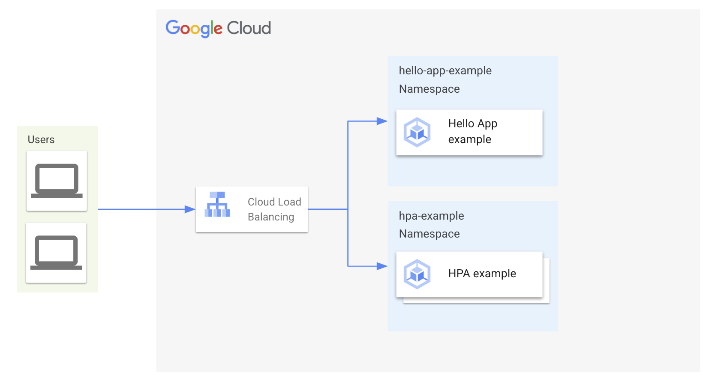
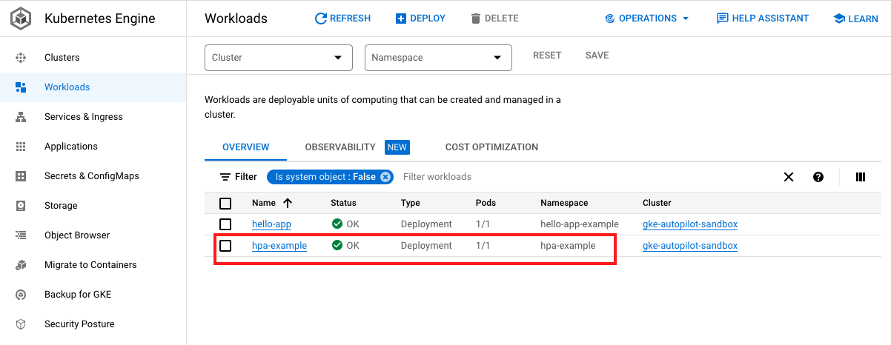

[](https://cloud.google.com/?utm_source=github&utm_medium=referral&utm_campaign=GCP&utm_content=packages_repository_banner)

# Build an auto scaling application easily with GKE autopilot

## Introduction 

_This architecture uses click-to-deploy so you can spin up infrastructure in
minutes using terraform!_

This architecture uses click-to-deploy to demonstrate how to use Horizontal Pod
Autoscaling (HPA) to scale the number of pods based on CPU utilization.

Businesses need highly available applications to provide uninterrupted service
to customers and ensure a seamless user experience. However, achieving high
availability can be difficult and time-consuming, as it requires complex
configuration and management of infrastructure components.

GKE Autopilot is a managed Kubernetes environment that automates infrastructure
management tasks, including cluster orchestration, scaling, and security
updates. This allows businesses to focus on developing their applications rather
than worrying about infrastructure management.

Horizontal Pod Autoscaling complements GKE Autopilot by dynamically scaling
application pods to match demand. As the workload increases, additional pods are
automatically provisioned to distribute the load and maintain optimal
performance. Conversely, during periods of low demand, the number of pods can be
scaled down, optimizing resource utilization and cost-efficiency.

This solution offers several benefits for businesses. It allows them to focus on
developing their applications and delivering value to customers, rather than
dealing with infrastructure complexities. By leveraging GKE Autopilot and
Horizontal Pod Autoscaling, businesses can achieve high availability without the
need for extensive manual configuration or ongoing maintenance.

## Use cases 

Any web page or application that might require the following:

- **Handling Variable Workloads**: During peak periods, HPA scales up the number
  of pods to accommodate increased traffic, ensuring optimal performance and
  responsiveness. Conversely, during periods of low utilization, HPA scales down
  the pods, optimizing resource utilization and reducing costs.
- **Optimizing Resource Allocation**: As CPU utilization increases, HPA scales
  up the number of pods, preventing resource bottlenecks and ensuring that the
  application has enough compute capacity to handle the load effectively.By
  scaling down pods during low utilization, HPA frees up resources, enabling
  other applications or services to use them efficiently.
- **Improve Performance and User Experience**: GKE HPA enables organizations to
  maintain optimal application performance and deliver an enhanced user
  experience. This results in a responsive and reliable application experience
  for end-users.

## Architecture 



The main components that we would be setting up are:

- [VPC][1] : Global virtual network that spans all regions. Single
  VPC for an entire organization, isolated within projects. Increase IP space
  with no downtime
- [Subnet][2] : Subnets are regional resources, and have IP address
  ranges associated with them.
- [NAT][3] : Provides fully managed, software-defined network
  address translation support for Google Cloud.
- [GKE Autopilot][4] : GKE Autopilot is a mode of operation in GKE
  in which Google manages your cluster configuration, including your nodes,
  scaling, security, and other preconfigured settings.

## Costs 

GKE Autopilot is charged by resources allocated for each pod - vCPU, Memory and Storage. So, if you want to estimate GKE Autopilot costs, please check how many resources your workloads need and check the resources' pricing [here][5].

## Setup 

This solution assumes you already have a project created and set up where you
wish to host these resources. If not, and you prefer the solution to create a new project, please follow the instructions in the [GitHub repository][6].

### Prerequisites 

- Have an [organization][7] set up in Google cloud.
- Have a [billing account][8] set up.
- Have an existing [project][9] with [billing
  enabled][10], we'll call this the **service project**.

### Roles & Permissions 

In order to spin up this architecture, you will need to be a user with the **Project owner** [IAM][11] role on the existing project:

> __Note__: To grant a user a role, take a look at the [Granting and Revoking Access][12] documentation.

### Deploy the architecture

:clock1: Estimated deployment time: 10 min

1. Click on Open in Google Cloud Shell button below.

<a
href="https://ssh.cloud.google.com/cloudshell/editor?cloudshell_git_repo=https://github.com/GoogleCloudPlatform/click-to-deploy-solutions&cloudshell_workspace=gke-autopilot-hpa&cloudshell_open_in_editor=terraform/terraform.tfvars&&cloudshell_tutorial=tutorial.md"
target="_new"></a>

1. Set the **Project ID** for the deployment.

```
gcloud config set project PROJECT_ID
```

1. Run the prerequisites script to enable APIs and set Cloud Build permissions. You should see the script end with `Script completed successfully!`

```
sh prereq.sh
```

1. Run the Cloud Build Job

```
gcloud builds submit . --config build/cloudbuild.yaml
```

### Testing your architecture 

Once you have deployed the solution, you can run a load test and see the HPA in
action.

Go to [Workloads][13] page and see the `hpa-example` application has
one replica. After the script is finished, it may take a few additional minutes for the pods to fully spin up. It may take an additional few minutes to see the
following:



To run the load test and see the HPA working, go back to the Cloud Shell
console, then run the load test script:

```bash
HPA_LB_IP=$(gcloud compute addresses describe hpa-lb-ip --global --format='value(address)')
sh load_test.sh $HPA_LB_IP
```

The script will call the service many times causing the CPU to cross the target
defined in the HPA for scaling out.


## Cleaning up your environment 

Execute the command below on Cloud Shell to delete the resources.

```
gcloud builds submit . --config build/cloudbuild_destroy.yaml
```

<!-- BEGIN TFDOC -->

## Variables

| name | description | type | required | default |
|---|---|:---:|:---:|:---:|
| [project_id](variables.tf) | Project id, references existing project if `project_create` is null. | <code>string</code> | ✓ |  |

## Outputs

| name | description |
|---|---|
| HPA External IP | Allows for connections outside of Google Cloud to reach the application. |  |

<!-- END TFDOC -->

[1]: https://cloud.google.com/vpc
[2]: https://cloud.google.com/vpc/docs/subnets
[3]: https://cloud.google.com/nat/docs/overview
[4]: https://cloud.google.com/kubernetes-engine/docs/concepts/autopilot-overview
[5]: https://cloud.google.com/kubernetes-engine/pricing
[6]: https://github.com/GoogleCloudPlatform/click-to-deploy-solutions/tree/main/gke-autopilot-hpa
[7]: https://cloud.google.com/resource-manager/docs/creating-managing-organization
[8]: https://cloud.google.com/billing/docs/how-to/manage-billing-account
[9]: https://cloud.google.com/resource-manager/docs/creating-managing-projects
[10]: https://cloud.google.com/billing/docs/how-to/modify-project
[11]: https://cloud.google.com/iam
[12]: https://cloud.google.com/iam/docs/granting-changing-revoking-access#grant-single-role
[13]: https://console.cloud.google.com/kubernetes/workload/overview
